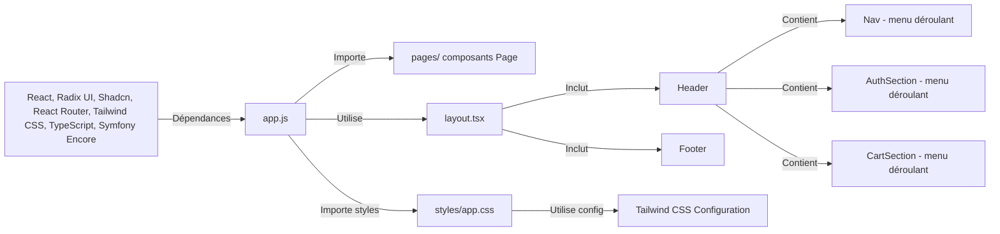

# Demarrage

## Développement

1. **Créer un fichier `.env`** (copier depuis `.env.example` si disponible):

   ```bash
   # Pour le développement, laissez VITE_API_URL vide pour utiliser le proxy Vite
   VITE_API_URL=
   ```

2. **Démarrer le serveur backend** (dans le dossier `back/`):

   ```bash
   symfony server:start
   ```

3. **Démarrer le serveur frontend** (dans le dossier `front/`):

   ```bash
   npm run dev
   ```

4. **Accéder à l'application**:
   - Frontend: <http://localhost:5173>
   - Backend API: <http://127.0.0.1:8000>

## Production

Pour la production, configurez `VITE_API_URL` dans votre `.env`:

```bash
VITE_API_URL=https://api.votredomaine.com
```

Puis build l'application:

```bash
npm run build
```

## Principales librairies utilisées

- **React**: Une bibliothèque JavaScript pour créer des interfaces utilisateur.
- **RadixUI et Shadcn** : Un ensemble de composants d'interface utilisateur React.
- **React Router(lib)**: Un ensemble de composants de routage client pour les applications React.
- **Tailwind CSS**: Le framework CSS.
- **TypeScript**: Superset de JavaScript.
- **Symfony Encore**: Un outil pour compiler les actifs frontaux dans les applications Symfony utilisant Webpack.

## Structure des dossiers

### components/

Contient des composants React réutilisables. Le dossier UI (components/ui) contient des composants dédié exclusivement à de l'interface utilisateur Shadcn/Radix.

#### exemple d'un composant

[Header.tsx]("/components/Header.tsx") :

- Composant principal = Header,
- 3 menus déroulant :
  - Nav pour la navigation,
  - AuthSection pour l'authentification
  - CartSection pour le panier.
- Utilise des sous-composants Radix/Shadcn (100% UI)
- Utilise des sous-composants personnalisé (100% UI):
  - CartProduct présente les produits du panier
  - Input pour les formulaires
  - Button pour les boutons
  - Content est un composant Radix pour les contenus des menus déroulant
  - Subtitle est un composant Radix pour les label des menus déroulants
  - Box est un élément soit div soit form

### images/

Contient des images utilisées dans l'application.
Compilé par webpack encore dans le dossier public/build/images.

### layout.tsx

Contient le layout de toutes les pages de l'application. Tous ce que les pages ont en commun (Header, Footer, et main)

```tsx
<>
    <Header links={links} />
    <main className="relative w-screen flex flex-col min-h-screen">{children}</main>
    <Footer />
</>
```

### pages/

Un fichier = une page de l'application. Les composants Pages sont importé dans app.js et distribuer en fonction des routes :

```tsx
<Routes>
    {links.map((link) => {
        const { Page, href, label } = link;
        return (
            <Route
                key={label}
                path={href}
                element={
                    <Layout links={links}>
                        <Page />
                    </Layout>
                }
            />
        );
    })}
</Routes>
```

### styles/

Contient les fichiers de styles. app.css est point d'entrée des styles tailwind.

### types.ts

Fichiers avec des types TypeScript exporté vers les autres fichiers.

### utils.ts

Contient des fonctions utilitaires.

## Tailwind CSS Configuration

Contient la configuration de Tailwind CSS dont les éléments d'identité visuelle comme :
⚠️ pas à jour

```js

colors: {
                primary: "#093C6F",
                secondary: "#D6AD3A",
                dark: {
                    primary: "#1D1D1F",
                    secondary: "#2C2C2C",
                },
                grey: "#757575",
            },

```

### Diagramme de composants


